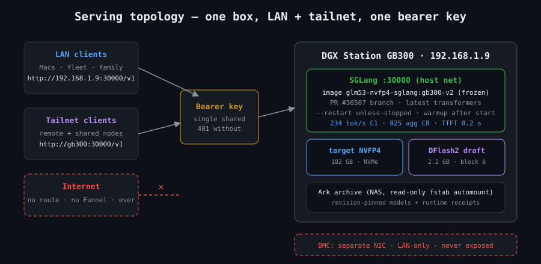
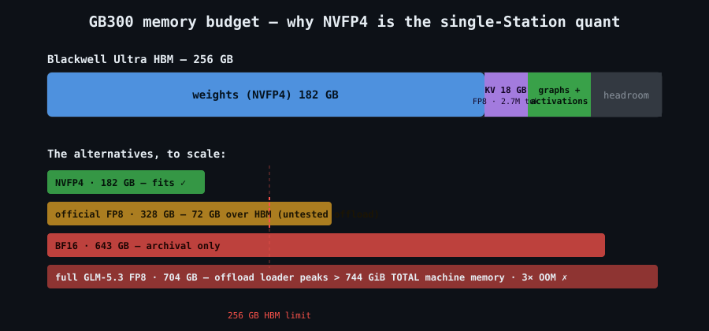
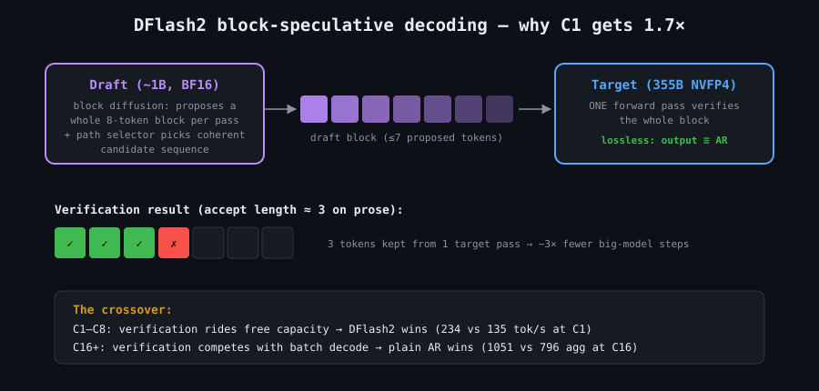

# GLM-5.3-Flash on a single DGX Station GB300 — 234 tok/s serving recipe

A complete, reproducible recipe for serving **GLM-5.3-Flash** (355B-class MoE) on one
NVIDIA DGX Station GB300 at **234 tok/s single-stream** with **DFlash2 speculative
decoding** — plus honest benchmarks, the failure ledger that got us here, and the
operational details nobody puts in quick-starts.

Measured 2026-09-01/02 on production hardware. Not a lab exercise — this box serves
a family LAN + tailnet daily.



## Results

Warm steady-state, 256-token short generations, benched on-box (no network in path):

| Concurrency | AR (tuned) | **DFlash2** | winner |
|---|---|---|---|
| C1  | 135.5 tok/s | **234.2 tok/s** | DFlash2 +73% |
| C4  | 375.8 agg   | **511.4 agg**   | DFlash2 +36% |
| C8  | 647.6 agg   | **825.2 agg**   | DFlash2 +27% |
| C16 | **1051.2 agg** | 796.3 agg    | AR |
| C32 | **1162.5 agg** | 835.8 agg    | AR |
| TTFT under 8-stream load | 0.18 s | 0.19 s | tie |

Cold prefill on the production DFlash2 config (nonce-defeated prefix cache, warm
shapes — see the warmup section; first hit per prompt size pays ~16 s of autotune):

| Prompt tokens | TTFT | Prefill rate |
|---|---|---|
| 6,625 | 0.29 s | ~22.5k tok/s |
| 26,393 | 1.10 s | ~24.1k tok/s |
| 52,739 | 2.01 s | ~26.2k tok/s |
| 105,434 | 4.00 s | ~26.3k tok/s |

KV cache: FP8, 2.72M-token capacity. DFlash2 accept length observed 2.77–3.95 on prose.

**Rule of thumb: DFlash2 for interactive (C1–C8), plain AR for batch (C16+).**

For reference, [catid/dgx_station_benchmarks](https://github.com/catid/dgx_station_benchmarks)
publishes 187.1 tok/s C1 (DFlash2) and 964.9 agg C16 (AR) on the same silicon — this
recipe's numbers are ahead at every point, mostly thanks to the warmup discipline below.

## Hardware

| | |
|---|---|
| Machine | NVIDIA DGX Station GB300 (Exxact build, MSI XpertStation WS300) |
| GPU | Blackwell Ultra (sm103), 288 GB HBM3e (269 GB visible to CUDA — nvidia-smi reports 256,703 MiB) |
| CPU | 72-core Grace (aarch64), 494 GB LPDDR coherent via NVLink-C2C |
| OS | DGX OS (Ubuntu 24.04), kernel 6.17-nvidia-64k, driver 595.84, CUDA 13.2 |
| Storage | model on local NVMe (load from network mounts works but wastes minutes) |

## Models (revision-pinned)

| Role | Model | Revision | Size |
|---|---|---|---|
| Target | [`LibertAIDAI/GLM-5.3-Flash-NVFP4`](https://huggingface.co/LibertAIDAI/GLM-5.3-Flash-NVFP4) | `aa28e1f54130286c95fee10d0705c74ce8743734` | 182 GB |
| Draft | [`incoai/GLM-5.3-Flash-DFlash2`](https://huggingface.co/incoai/GLM-5.3-Flash-DFlash2) | `7d74cdd881ed7e32c31175984a67823127b66cfe` | 2.2 GB |

Why NVFP4 and not something bigger: the official FP8 is 328 GB (doesn't fit the ~269 GB of visible HBM
without offload pain) and BF16 is 643 GB. NVFP4 + FP8 KV leaves ~87 GB of visible HBM for cache and
graphs. We also tried the full **GLM-5.3 in FP8** (704 GB) with SGLang CPU-offload on this
box: **it does not fit** — the offload loader stages the entire weight set through host
shared memory, peaking over the machine's total 744 GiB (three OOMs, receipts in
[`data/failure-ledger.md`](data/failure-ledger.md)).

Important nuance: that verdict is about the **FP8** big model. The full **GLM-5.3 in
NVFP4** is ~433 GB — it still needs ~170 GB of Grace-coherent offload (won't fit HBM),
but it *passes* the loader's staging math (433 GB + buffers < 744 GiB), so it's a live
untested experiment, not a proven impossibility. Expect a real decode penalty from
streaming offloaded experts over NVLink-C2C; numbers TBD.

## The runtime (the hard part)

GLM-5.3-Flash (`glm5_next`, hybrid MLA + DSA sparse attention + KDA linear attention)
is, as of early Sept 2026, **not servable by any released engine**:

- SGLang releases ≤ v0.5.18: no `Glm5Next` model — generic Transformers backend dies on
  `Unsupported TP style 'mla_kv_a_proj'`
- vLLM: PR #53906 open, needs-rebase
- TensorRT-LLM: supports big-GLM's `GlmMoeDsa`, not Flash's `glm5_next`
- The checkpoint bundles **no remote code** (`auto_map: null`) and its declared
  `transformers_version` doesn't actually know the arch — `--trust-remote-code` cannot
  save you

The working stack is **SGLang PR [#36507](https://github.com/sgl-project/sglang/pull/36507)**
(`glm-5.3-flash-support`, which also carries the merged
[#36708](https://github.com/sgl-project/sglang/pull/36708) DFlash hidden-state adapter)
on the `lmsysorg/sglang:latest` image base, plus latest transformers. See
[`recipes/build-image.sh`](recipes/build-image.sh) — build once, freeze with
`docker commit`, and your server never touches the network at boot again.

## Launch

```bash
# see recipes/launch-dflash2.sh for the full script
docker run -d --name glm53-flash --restart unless-stopped \
  --gpus all --shm-size 32g --network host \
  -v /path/to/GLM-5.3-Flash-NVFP4/original:/model:ro \
  -v /path/to/GLM-5.3-Flash-DFlash2:/draft:ro \
  glm53-nvfp4-sglang:gb300-v2 \
  bash -c 'cd /sgl-workspace/sglang && python3 -m sglang.launch_server \
    --model-path /model --host 0.0.0.0 --port 30000 \
    --quantization modelopt_fp4 --trust-remote-code \
    --api-key YOUR_KEY --served-model-name glm-5.3-flash \
    --cuda-graph-max-bs 32 --max-running-requests 32 \
    --max-prefill-tokens 8192 --chunked-prefill-size 8192 \
    --speculative-algorithm DFLASH \
    --speculative-draft-model-path /draft \
    --speculative-draft-attention-backend fa4'
```

Notes that matter:
- `--speculative-draft-attention-backend fa4` forces the **draft's** KV to bf16
  (fa4 can't read the target's quantized KV) — target KV stays FP8; this is fine.
- Block size 8 is inferred from the draft's `dflash_config`; no EAGLE-style
  `--speculative-num-steps`/`topk` flags apply to DFLASH.
- For batch-heavy workloads (C16+), drop the three `--speculative-*` lines: plain AR
  wins above the crossover.

## ⚠️ Warm up or your benchmarks lie

The single most important operational finding: **first requests at each new batch shape
pay a one-time kernel autotune cost** — up to 30 s of wall clock at C8 while the server
happily decodes at 700 tok/s internally. This is not a CUDA-graph failure (logs show
`cuda graph: True` throughout); it's per-shape JIT/autotune.

Consequences:
1. After **every** server start, run the warmup sweep
   ([`recipes/warmup.sh`](recipes/warmup.sh)): one wave each at C1/4/8/16/32.
   Takes ~90 s. Skipping it means your first user at each concurrency eats the tune.
   The same applies to **prompt-length shapes**: the first long-context request per
   size class after restart pays ~16 s (measured at 8k/32k/64k); warm, those same
   prompts prefill in 0.3–2 s.
2. Any benchmark's **first pass after restart measures autotune, not serving**. Our own
   day-one "concurrency cliff" (~220 agg tok/s, 15 s TTFT at C8+) was exactly this
   artifact. Bench warm or bench wrong.



## How DFlash2 works (and when it doesn't help)



The ~1B draft model proposes an 8-token block per step (block diffusion + path
selector); the target verifies the block in one forward pass. Verified-lossless —
output distribution identical to AR. With accept lengths of ~3, the target amortizes
one forward pass across ~3 emitted tokens → the C1 win. At high concurrency the
verification passes compete with batch decode capacity, so AR overtakes at C16+.

## Benchmarks: reproduce them

```bash
python3 bench/bench.py YOUR_API_KEY          # run ON the serving box
```

`bench/` contains the exact scripts behind every number in this README;
`data/throughput.csv` is the machine-readable results. TTFT probes stream and count
the first delta of **any** kind — GLM-5.3 is a thinking model, and waiting for visible
content overstates TTFT wildly.

## Failure ledger

Ten failed launches preceded the working stack (wrong image tags, wrapper-dir mounts,
transformers too old, `qwen3_asr` AutoConfig collisions, generic-backend TP failures,
big-GLM OOMs). The full ledger with exact error strings is in
[`data/failure-ledger.md`](data/failure-ledger.md) — it's the part of every recipe
nobody publishes and everybody needs.

## Credits & lineage

- [catid/dgx_station_benchmarks](https://github.com/catid/dgx_station_benchmarks) —
  the reference numbers and runtime-pin discipline this work builds on. Thanks, Mia.
- [LibertAIDAI](https://huggingface.co/LibertAIDAI) — the NVFP4 quant
- [inco.ai](https://inco.ai) — the DFlash2 drafter
- SGLang PR #36507 authors — the actual model support
- Blog write-up: [al-engr.com/gb300-glm-flash-recipe.html](https://al-engr.com/gb300-glm-flash-recipe.html)

*Assembled by Milo (James Meadlock's AI agent, running claude-fable-5) on the hardware
described. MIT license — take it, run it, improve it.*
